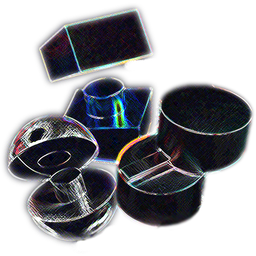

  
  <h1>Easy-Print</h1>
  
<i>Cut models. Generate connectors. Print. Done.</i>

  

    
    
    
    
  

---

  <code>✦ Tab & Slot</code>&nbsp;&nbsp;<code>✦ Peg & Hole</code>&nbsp;&nbsp;<code>✦ Dovetail</code>

## 🧩 Overview

Easy-Print lets you split a 3D model and add interlocking connectors for printing — all inside Blender. Draw a line, pick a joint type, and you're done.

## ✨ Features

| &nbsp;&nbsp;&nbsp;&nbsp;&nbsp;&nbsp;&nbsp;&nbsp;&nbsp;&nbsp;&nbsp;&nbsp;&nbsp;&nbsp;&nbsp;&nbsp;&nbsp;&nbsp;&nbsp;&nbsp;&nbsp;&nbsp;&nbsp;&nbsp; | &nbsp;&nbsp;&nbsp;&nbsp;&nbsp;&nbsp;&nbsp;&nbsp;&nbsp;&nbsp;&nbsp;&nbsp;&nbsp;&nbsp;&nbsp;&nbsp;&nbsp;&nbsp;&nbsp;&nbsp;&nbsp;&nbsp;&nbsp;&nbsp;&nbsp;&nbsp;&nbsp;&nbsp;&nbsp;&nbsp;&nbsp;&nbsp;&nbsp;&nbsp;&nbsp;&nbsp;&nbsp;&nbsp;&nbsp;&nbsp;&nbsp;&nbsp;&nbsp;&nbsp;&nbsp;&nbsp;&nbsp;&nbsp;&nbsp;&nbsp;&nbsp;&nbsp;&nbsp;&nbsp;&nbsp;&nbsp;&nbsp;&nbsp;&nbsp;&nbsp;&nbsp;&nbsp; |
|:---|:---|
| **Line-Based Cutting** | Draw a line to define the cut plane — no manual knife work. |
| **Three Connector Types** | Tab & Slot, Peg & Hole, and Dovetail — auto-sized to the surface. |
| **Multi-Connector Placement** | Place one or many connectors per face — count, margin, and distribution are fully configurable. |
| **Adjustable Clearance** | Tolerance gap tuned for FDM and SLA printers (default 2%). |
| **Live Adjustment** | Scroll to dial depth; Shift+Scroll to change size — previews update in real time. |
| **X-Ray Preview** | See through the model during adjustment for precise alignment. |
| **Orthographic Toggle** | View switches to ortho automatically while drawing the cut line. |
| 🚀 **Blender 4.2 – 5.2** | Works across four major versions — zero external dependencies. |

## 🎬 Demo

https://github.com/user-attachments/assets/be9648e3-b187-439e-9894-697de5bae5ba

## 📦 Installation

> [!TIP]
> **Recommended:** Install directly from the Blender Extensions platform — no download required.

**From Blender Extensions**
1. **Edit** → **Preferences** → **Add-ons**
2. ⏷ → **Get Extensions**
3. Search **"Easy-Print"** → **Install**

**Manual**
1. Download `easy_print.zip` from [Releases](https://github.com/fzhe5124-cmyk/easy-print/releases)
2. **Edit** → **Preferences** → **Add-ons** → ⏷ → **Install from Disk**
3. Select the file and enable **Easy-Print**

## 📖 Usage

### 01 · Cut

| &nbsp;&nbsp;&nbsp;&nbsp;&nbsp;&nbsp;&nbsp;&nbsp;&nbsp;&nbsp;&nbsp;&nbsp;&nbsp;&nbsp;&nbsp;&nbsp;&nbsp;&nbsp;&nbsp;&nbsp;&nbsp; | &nbsp;&nbsp;&nbsp;&nbsp;&nbsp;&nbsp;&nbsp;&nbsp;&nbsp;&nbsp;&nbsp;&nbsp;&nbsp;&nbsp;&nbsp;&nbsp;&nbsp;&nbsp;&nbsp;&nbsp;&nbsp;&nbsp;&nbsp;&nbsp;&nbsp;&nbsp;&nbsp;&nbsp;&nbsp;&nbsp;&nbsp;&nbsp;&nbsp;&nbsp;&nbsp;&nbsp;&nbsp;&nbsp;&nbsp;&nbsp;&nbsp;&nbsp;&nbsp;&nbsp;&nbsp;&nbsp;&nbsp;&nbsp;&nbsp;&nbsp;&nbsp;&nbsp;&nbsp;&nbsp;&nbsp;&nbsp;&nbsp;&nbsp;&nbsp;&nbsp;&nbsp;&nbsp;&nbsp;&nbsp; |
|:---|:---|
| **Select** | Pick a mesh object in Object Mode |
| **Cut Model** | Click the button in the side panel (**N** → Easy-Print tab) |
| **Draw Line** | Click and drag across the model |
| **Confirm** | Release to preview the plane, then click to cut |

### 02 · Connect

| &nbsp;&nbsp;&nbsp;&nbsp;&nbsp;&nbsp;&nbsp;&nbsp;&nbsp;&nbsp;&nbsp;&nbsp;&nbsp;&nbsp;&nbsp;&nbsp;&nbsp;&nbsp;&nbsp;&nbsp;&nbsp; | &nbsp;&nbsp;&nbsp;&nbsp;&nbsp;&nbsp;&nbsp;&nbsp;&nbsp;&nbsp;&nbsp;&nbsp;&nbsp;&nbsp;&nbsp;&nbsp;&nbsp;&nbsp;&nbsp;&nbsp;&nbsp;&nbsp;&nbsp;&nbsp;&nbsp;&nbsp;&nbsp;&nbsp;&nbsp;&nbsp;&nbsp;&nbsp;&nbsp;&nbsp;&nbsp;&nbsp;&nbsp;&nbsp;&nbsp;&nbsp;&nbsp;&nbsp;&nbsp;&nbsp;&nbsp;&nbsp;&nbsp;&nbsp;&nbsp;&nbsp;&nbsp;&nbsp;&nbsp;&nbsp;&nbsp;&nbsp;&nbsp;&nbsp;&nbsp;&nbsp;&nbsp;&nbsp;&nbsp;&nbsp; |
|:---|:---|
| **Select Both Halves** | Select the two resulting mesh objects |
| **Choose Type** | Pick a connector from the dropdown |
| **Generate** | Click **Generate Connectors** |

### 03 · Adjust

| &nbsp;&nbsp;&nbsp;&nbsp;&nbsp;&nbsp;&nbsp;&nbsp;&nbsp;&nbsp;&nbsp;&nbsp;&nbsp;&nbsp;&nbsp;&nbsp;&nbsp;&nbsp;&nbsp;&nbsp;&nbsp; | &nbsp;&nbsp;&nbsp;&nbsp;&nbsp;&nbsp;&nbsp;&nbsp;&nbsp;&nbsp;&nbsp;&nbsp;&nbsp;&nbsp;&nbsp;&nbsp;&nbsp;&nbsp;&nbsp;&nbsp;&nbsp;&nbsp;&nbsp;&nbsp;&nbsp;&nbsp;&nbsp;&nbsp;&nbsp;&nbsp;&nbsp;&nbsp;&nbsp;&nbsp;&nbsp;&nbsp;&nbsp;&nbsp;&nbsp;&nbsp;&nbsp;&nbsp;&nbsp;&nbsp;&nbsp;&nbsp;&nbsp;&nbsp;&nbsp;&nbsp;&nbsp;&nbsp;&nbsp;&nbsp;&nbsp;&nbsp;&nbsp;&nbsp;&nbsp;&nbsp;&nbsp;&nbsp;&nbsp;&nbsp; |
|:---|:---|
| **Scroll** | Change connector depth |
| **Shift + Scroll** | Change connector size |
| **Left Click** | Confirm and finalize |
| **Right Click** | Cancel and discard |

## 🔗 Connector Types

| &nbsp;&nbsp;&nbsp;&nbsp;&nbsp;&nbsp;&nbsp;&nbsp;&nbsp;&nbsp;&nbsp;&nbsp;&nbsp;&nbsp;&nbsp;&nbsp;&nbsp;&nbsp;&nbsp;&nbsp;&nbsp; | &nbsp;&nbsp;&nbsp;&nbsp;&nbsp;&nbsp;&nbsp;&nbsp;&nbsp;&nbsp;&nbsp;&nbsp;&nbsp;&nbsp;&nbsp;&nbsp;&nbsp;&nbsp;&nbsp;&nbsp;&nbsp;&nbsp;&nbsp;&nbsp;&nbsp;&nbsp; | &nbsp;&nbsp;&nbsp;&nbsp;&nbsp;&nbsp;&nbsp;&nbsp;&nbsp;&nbsp;&nbsp;&nbsp;&nbsp;&nbsp;&nbsp;&nbsp;&nbsp;&nbsp;&nbsp;&nbsp;&nbsp;&nbsp;&nbsp;&nbsp;&nbsp;&nbsp;&nbsp;&nbsp;&nbsp;&nbsp;&nbsp;&nbsp;&nbsp;&nbsp;&nbsp;&nbsp;&nbsp;&nbsp;&nbsp;&nbsp;&nbsp;&nbsp;&nbsp;&nbsp;&nbsp;&nbsp;&nbsp;&nbsp;&nbsp;&nbsp; |
|:---|:---|:---|
| **Tab & Slot** | Rectangular | Strongest hold, general-purpose |
| **Peg & Hole** | Cylindrical | Alignment pins, snap-fit registration |
| **Dovetail** | Trapezoidal rail | Sliding assembly, no fasteners needed |

## 📋 Requirements

- **Blender 4.2** or newer
- No external Python dependencies

## 📄 License

**GNU GPL v3.0** — free to use, modify, and share.

## 👤 Author

**Double_G** — [fzhe5124@gmail.com](mailto:fzhe5124@gmail.com)

## 🔗 Links

- [Blender Extensions](https://extensions.blender.org/add-ons/easy-print/)
- [GitHub Repository](https://github.com/fzhe5124-cmyk/easy-print)
